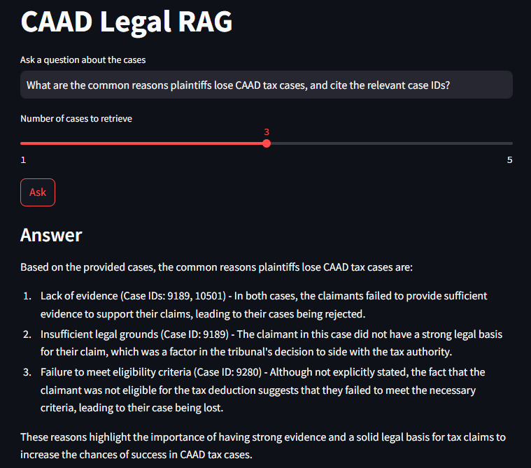

# Legal Document Intelligence (CAAD Tax Decisions)

This project scrapes Portuguese tax law decisions from CAAD, extracts structured JSON with help of an LLM, builds a simple vector database (chromadb), and supports a RAG Q&A UI.

## Quickstart from scratch

1) Clone repository and enter project folder
- `git clone <your-repo-url>`
- `cd ManekTech`

2) Create and activate a virtual environment
- Windows PowerShell:
	- `python -m venv .venv`
	- `./.venv/Scripts/Activate.ps1`

3) Install dependencies from `requirements.txt`
- `pip install -r requirements.txt`

4) Configure environment
- Copy `.env.example` to `.env` and set required keys:
	- `GEMINI_API_KEY` (embeddings / generation)
	- `GROQ_API_KEY` (fallback extraction / generation)

## Setup

Use the Quickstart section above.

## Run the pipeline

**Note:**
For demonstration and testing, we have chosen to process 50 cases (`--limit 50`). This number is sufficient to show the pipeline works end-to-end, is manageable for local resources, and meets the practical requirements of the task. You can increase this limit for larger experiments if desired.

1) Scrape CAAD decisions
- `python src/scrape_caad.py --max-pages 3 --limit 50`

2) Extract structured JSON with LLM
- `python src/extract_cases.py --input data/raw/raw_index.jsonl --output data/processed/cases.jsonl`

3) Build vector database
- `python src/build_vector_db.py --input data/processed/cases.jsonl --persist data/chroma`

4) Start the UI
- `streamlit run src/ui_app.py`

## Demo Screenshots

### UI Screenshots


### Retrieved Cases with Citations


The UI demonstrates:
- End-to-end RAG pipeline: question → retrieval → answer generation.
- **Clickable case ID links** that open original CAAD decisions, proving data integrity from source to final output.
- Multi-model fallback strategy for robust answer generation.
- Clear refusal behavior: when the assistant responds with an uncertainty/refusal answer (for example, "I do not know"), the UI hides retrieved case IDs to avoid presenting low-confidence citations as evidence.

## Notes

### Data Integrity & Source Attribution

Retrieved case IDs are direct clickable links to the original [CAAD website](https://caad.org.pt/tributario/decisoes/), ensuring full traceability from raw data source through extraction, embedding, retrieval, and final answer. This demonstrates that the ETL pipeline (Part 1) maintained referential integrity end-to-end.

### Refusal Handling in the UI

If the answer generator returns a refusal/uncertainty response (for example, "I do not know" or similar variants), the app shows the answer but does not display the retrieved-case list. This is intentional: it prevents users from interpreting unrelated retrieval results as validated legal support.

### LLM Fallback for RAG Question Answering

The RAG question answering system uses a multi-model fallback strategy for answer generation:

1. **Gemini (Google AI Studio)** – Primary model for answer generation.
2. **Groq Llama-3** – If Gemini fails, the system automatically tries Groq Llama-3 (70B or 8B, as configured).
3. **Groq Mixtral** – If both above fail, Groq Mixtral is used as a final fallback.

This ensures robust and reliable answers even if one provider is unavailable or rate-limited. You can configure model priorities and API keys in the `.env` file.
- No API keys are committed. Use `.env` locally only.
- You can change models via environment variables:
	- `GEMINI_MODEL` (default: `gemini-1.5-flash-latest`)
	- `GEMINI_EMBED_MODEL` (default: `models/embedding-001`)

## Project structure

- `src/scrape_caad.py` - scrape listing pages and case text
- `src/extract_cases.py` - LLM extraction into strict JSON (Groq)
- `src/build_vector_db.py` - embed and store in Chroma (Gemini embeddings)
- `src/rag_qa.py` - retrieval and answer generation (Gemini)
- `src/ui_app.py` - Streamlit UI
- `src/gemini_client.py` - Gemini API client
- `data/raw` - scraped raw text
- `data/processed` - extracted JSON
- `data/chroma` - vector DB

## Requirement checklist

- Reproducibility: `README.md` includes end-to-end setup and run commands from scratch.
- Reproducibility: `requirements.txt` is present and used for dependency installation.
- Modularity: extraction, vector DB build, retrieval, and chat UI are separated into dedicated scripts.

## Available models & how to change them

You can list the provider model options shipped with this repo and change which model is used for generation or embeddings:

- List Gemini models (run locally):

```powershell
python src/list_gemini_models.py
```

- List Groq models (run locally):

```powershell
python src/list_groq_models.py
```

To change which model the pipeline uses, set the environment variables in your local `.env` (or export them in your shell) before running the app or indexing step. Common variables:

- `GEMINI_MODEL` — generation model used by Gemini
- `GEMINI_EMBED_MODEL` — embedding model used by Gemini
- `GROQ_MODEL` — primary Groq generation model
- `GROQ_MODEL_FALLBACK` — Groq fallback model

Example in PowerShell:

```powershell
set-item -path env:GEMINI_MODEL -value "gemini-1.5-flash"
set-item -path env:GEMINI_EMBED_MODEL -value "models/embedding-001"
```

After changing models, restart the Streamlit UI or re-run the indexing step to ensure the new model choice is used.
